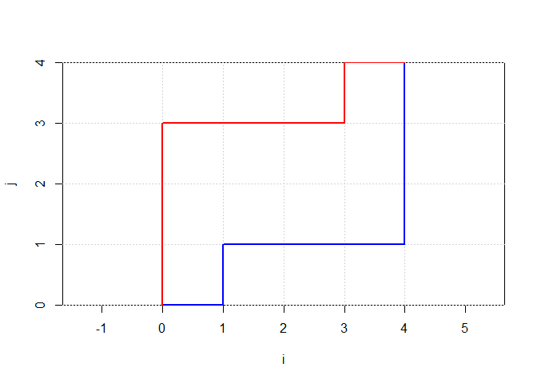

<!-- README.md is generated from README.Rmd. Please edit that file -->

# streets

<!-- badges: start -->
<!-- badges: end -->

The goal of streets is to provide functions for working with paths
through 2D grids.

## Installation

You can install the development version of streets from
[GitHub](https://github.com/) with:

``` r
# install.packages("devtools")
devtools::install_github("mncube/streets")
```

## Load streets

``` r
library(streets)
```

## Manhattan Paths

On a 2D rectangular grid, all paths from the origin (0,0) to the
destination (i,j) have minimum Manhattan Distance if only upward and
rightward steps are allowed. The number of unique paths meeting this
condition (Manhattan Paths) can be computed in R as choose(i + j, j) or
as factorial(i+j)/(factorial(i)\*factorial(j)). Two example paths with
destination (4,4) are plotted below.

``` r
# Define the grid and paths
path1 <- rbind(c(0, 0), c(1, 0), c(1, 1), c(2, 1), c(3, 1), c(4, 1), c(4, 2), c(4, 3), c(4, 4))
path2 <- rbind(c(0, 0), c(0, 1), c(0, 2), c(0, 3), c(1, 3), c(2, 3), c(3, 3), c(3, 4), c(4, 4))

# Set up plot parameters
plot(NULL, xlim = c(0, 4), ylim = c(0, 4), xlab = "X", ylab = "Y", xaxs = "i", yaxs = "i", asp = 1)
abline(h = 0:4, v = 0:4, col = "lightgray", lty = 3)

# Plot the paths
lines(path1, col = "blue", lwd = 2)
lines(path2, col = "red", lwd = 2)
```



The mpaths function computes the number of unique Manhattan Paths from
the origin to the destination.

``` r
mpaths(destination = c(4,4))
#> [1] 70
```

## Target Paths

Target Paths are similar to Manhattan Paths but they force the paths to
pass through a target location. In the example below, two target paths
on a grid with destination (4,4) both pass through the target location
(2,2).

``` r
# Define the grid and paths
path1 <- rbind(c(0, 0), c(1, 0), c(2, 0), c(2, 1), c(2, 2), c(3, 2), c(4, 2), c(4, 3), c(4, 4))
path2 <- rbind(c(0, 0), c(0, 1), c(1, 1), c(1, 2), c(2, 2), c(2, 3), c(3, 3), c(3, 4), c(4, 4))

# Set up plot parameters
plot(NULL, xlim = c(0, 4), ylim = c(0, 4), xlab = "X", ylab = "Y", xaxs = "i", yaxs = "i", asp = 1)
abline(h = 0:4, v = 0:4, col = "lightgray", lty = 3)

# Plot the paths
lines(path1, col = "blue", lwd = 2)
lines(path2, col = "red", lwd = 2)

# Plot target location
points(2, 2, col = "green", pch = 19, cex = 1)
```


The total number of target paths to a fixed destination can be computed
with the tpaths function.

``` r
tpaths(destination = c(5,4), target = c(3,2))
#> [1] 60
```

### Target Paths Probability Functions

The tpaths function and the mpaths function can be used to define
probability distribution function.

The dtpaths function is a probability mass function where the number of
target paths passing through a target location is the event of interest
while the sum of target paths across all coordinates on the grid is the
sample space. The first example below shows the symmetry on a square
grid.

``` r
dtpaths(c(5,5), c(2,3))
#> [1] 0.03607504
dtpaths(c(5,5), c(3,2))
#> [1] 0.03607504
```

The next example shows normalization for dtpaths

``` r
  probs_tpaths <- 0
  for (x in 0:10){
    for (y in 0:10){
      probs_tpaths <- probs_tpaths + dtpaths(c(10,10), c(x,y))
    }
  }

print(probs_tpaths)
#> [1] 1
```

The ptpaths function is a cumulative distribution function for the
dtpaths probability mass function. The distribution is obtained by
iterating through all possible target coordinates up to and including
(ti, tj), computing dtpaths at each of these target coordinates, and
summing the results.

``` r
ptpaths(destination = c(8,8),target = c(4,4))
#> [1] 0.4659719
```

The qtpaths function is a quantile function which takes a probability p
and a destination (i, j) and returns the coordinates for the target
location (ti, tj) where the cumulative probability is equal to or just
greater than p. The wise argument allows you to search for the first
target location meeting the condition in a “row”-wise manner or a
“col”umn-wise manner. The default is “col”

``` r
qtpaths(destination = c(5,5), p =.5)
#> [1] 2 5
qtpaths(destination = c(5,5), p = .5, wise ="row")
#> [1] 3 3
```

The rtpaths function is a random variable function that generates random
target coordinates from the distribution defined by the dtpaths
probability mass function.

``` r
rtpaths(destination = c(10,10), n = 3)
#>    ti tj
#> 88 10  7
#> 75  8  6
#> 36  2  3
```

## Detour Paths

Detour Paths are similar to Target Paths but they force the paths NOT to
pass through a detour location. In the example below, two detour paths
on a grid with destination (4,4) both DO NOT pass through the detour
location (2,2).

``` r
# Define the grid and paths
path1 <- rbind(c(0, 0), c(1, 0), c(2, 0), c(2, 1), c(3, 1), c(3, 2), c(4, 2), c(4, 3), c(4, 4))
path2 <- rbind(c(0, 0), c(0, 1), c(1, 1), c(1, 2), c(1, 3), c(2, 3), c(3, 3), c(3, 4), c(4, 4))

# Set up plot parameters
plot(NULL, xlim = c(0, 4), ylim = c(0, 4), xlab = "X", ylab = "Y", xaxs = "i", yaxs = "i", asp = 1)
abline(h = 0:4, v = 0:4, col = "lightgray", lty = 3)

# Plot the paths
lines(path1, col = "blue", lwd = 2)
lines(path2, col = "red", lwd = 2)

# Plot detour location
points(2, 2, col = "green", pch = 19, cex = 1)
```


The total number of detour paths to a fixed destination can be computed
with the dpaths function.

``` r
dpaths(destination = c(5,4), detour = c(3,2))
#> [1] 66
```

Note the relation between mpaths, tpaths, and dpaths

``` r
mpaths(destination = c(5,4)) == tpaths(destination = c(5,4), target = c(3,2)) +
                                   dpaths(destination = c(5,4), detour = c(3,2))
#> [1] TRUE
```

### Detour Paths Probability Functions

The streets package has a probability mass function (ddpaths), a
cumulative probability function (pdpaths), a quantile function
(qdpaths), and a random variable functions (rdpaths) for detour paths.
See examples below.

``` r
# Symmetry of the probability mass function
ddpaths(c(5,5), c(2,3))
#> [1] 0.02412698
ddpaths(c(5,5), c(3,2))
#> [1] 0.02412698

# Normalization of the probability mass function
  probs_dpaths <- 0
  for (x in 0:10){
    for (y in 0:10){
      probs_dpaths <- probs_dpaths + ddpaths(c(10,10), c(x,y))
    }
  }

print(probs_dpaths)
#> [1] 1

# Cumulative distribution
pdpaths(destination = c(8,8), detour = c(4,4))
#> [1] 0.2668512

# Quantile function
qdpaths(destination = c(5,5), p =.5)
#> [1] 3 4
qdpaths(destination = c(5,5), p = .5, wise ="row")
#> [1] 5 2

# Random detour location
rdpaths(destination = c(10,10), n = 3)
#>    di dj
#> 56  0  5
#> 3   2  0
#> 76  9  6
```
